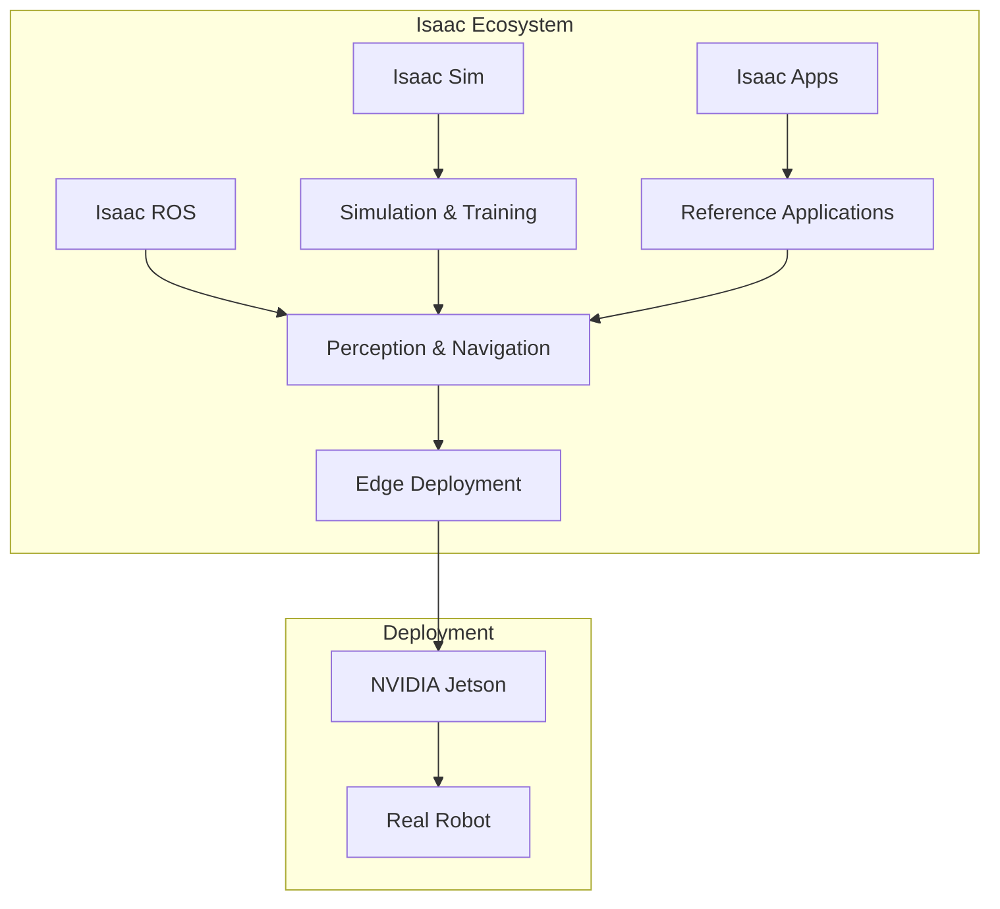

# Isaac Architecture Overview

## Isaac Ecosystem Components

```mermaid
graph TB
    subgraph "Isaac Ecosystem"
        A[Isaac ROS] --> D[Perception & Navigation]
        B[Isaac Sim] --> E[Simulation & Training]
        C[Isaac Apps] --> F[Reference Applications]
        D --> G[Edge Deployment]
        E --> D
        F --> D
    end

    subgraph "Deployment"
        G --> H[NVIDIA Jetson]
        H --> I[Real Robot]
    end
```

## Isaac Sim-to-Real Pipeline

```mermaid
graph LR
    A[Real World Data] --> B[Simulation Environment]
    B --> C[Domain Randomization]
    C --> D[Model Training]
    D --> E[Edge Optimization]
    E --> F[Real Robot Deployment]
    F --> A
```

## Perception Pipeline

```mermaid
graph LR
    A[Camera/LiDAR] --> B[Preprocessing]
    B --> C[Feature Extraction]
    C --> D[SLAM/Mapping]
    D --> E[Sensor Fusion]
    E --> F[Environment Understanding]
```